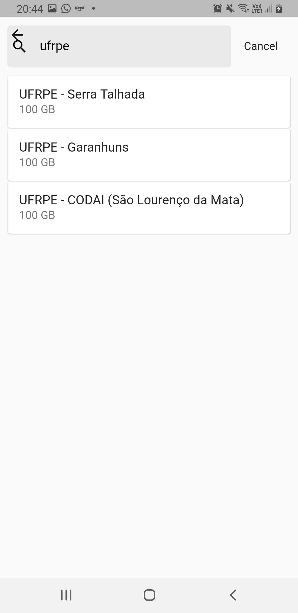

# FibrasdoBrasil
Aplicativo de Visualização de Dados de Redes de Fibra Óptica no Brasil

---

**Fibras do Brasil** é um aplicativo de visualização de mapas e dados das redes de fibra óptica do Brasil, além de estatísticas de qualidade de desempenho de forma a facilitar e unificar a distribuição dessas informações.

É assim que o aplicativo funciona: Na tela inicial, há a opção de ir para o mapa com os terminais de Fibra Óptica ou ir diretamente a página de estatísticas de cada terminal. Você pode explorar o mapa e escolher um terminal específico e as estatísticas de qualidade relacionadas a esta rede irão ser exibidos. Na página de estatísticas, deve-se pesquisar o terminal desejado e as estatísticas são exibidas, como capacidade de Download e Upload e a qualidade da rede, baseado na taxa de perdas. Nessa página, um arquivo .csv pode ser baixado.

Fibras do Brasil pode beneficiar todas as pessoas e organizações que precisarem de informações sobre as redes do brasil ou que estão simplesmente interessadas em conhecer a infraestrutura de fibras ópticas no Brasil.

## 💻 Videos de apresentação do Fibras do Brasil

Este primeiro vídeo tem como principal objetivo mostra de forma rápida a ideia geral do projeto.

- [Pitch Fibras do Brasil](https://www.youtube.com/watch?v=Cs6fKo4Tn1w)

Estou outro vídeo, mostra de forma clara o funcionamento de todos os recursos dentro do aplicativo.

- [Funcionamento do App Fibras do Brasil]()

## 📍 Features do App(ILIVE) e suas características

- Exibição dos terminais de Fibra Óptica da Rede Nacional de Ensino e Pesquisa (RNP) através de marcadores nos mapas;
- Exibição de qualidade da rede nos terminais através de clique no marcador;
- Busca de terminais de Fibra Óptica da RNP através de uma barra de pesquisa pelo nome ou pela capacidade de Download;
- Redirecionamento no mapa para o terminal selecionado;
- Exibição de capacidade de download e upload, e da qualidade da rede em uma página dedicada de estatísticas;
- Disponibilização para baixar em arquivo os dados completos dos terminais da rede.

## Desenvolvimento do App

### Logotipo fibrasdoBR-LOGO2.png 

### Fluxograma 

### Árvore de Widgets 
- Main

- MainPage

- Stats

.png)

- Maps

- Search

### Telas do App

- Tela MainPage

- Tela Stats

- Tela Maps

- Tela Search

## Como Você Pode Ajudar

* Avise sobre [issues](https://github.com/brunoarrudaufpe/FibrasdoBrasil/issues)
* Disponibilizar mais dados de outros terminais e rotas das redes de fibra óptica.

## História

Este aplicativo foi desenvolvido como projeto da disciplina de **Fundamentos de Programação Aplicada do Programa** de Pós-Graduação em Informática Aplicada da UFRPE.

